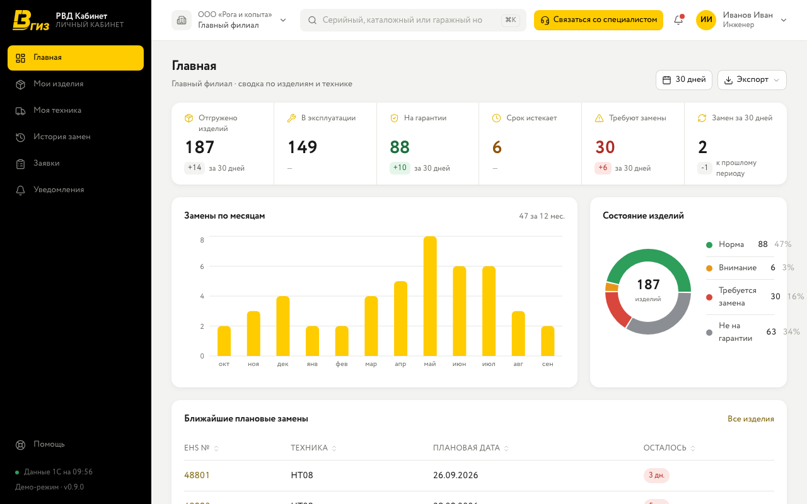
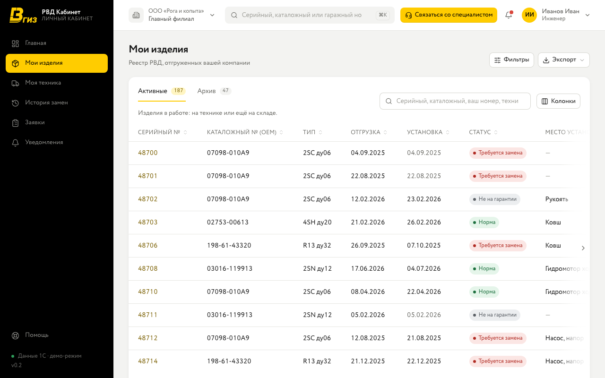
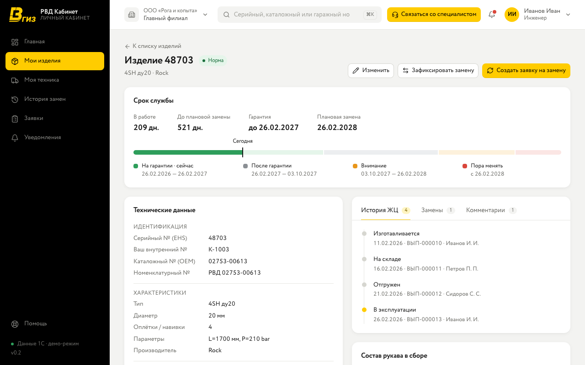
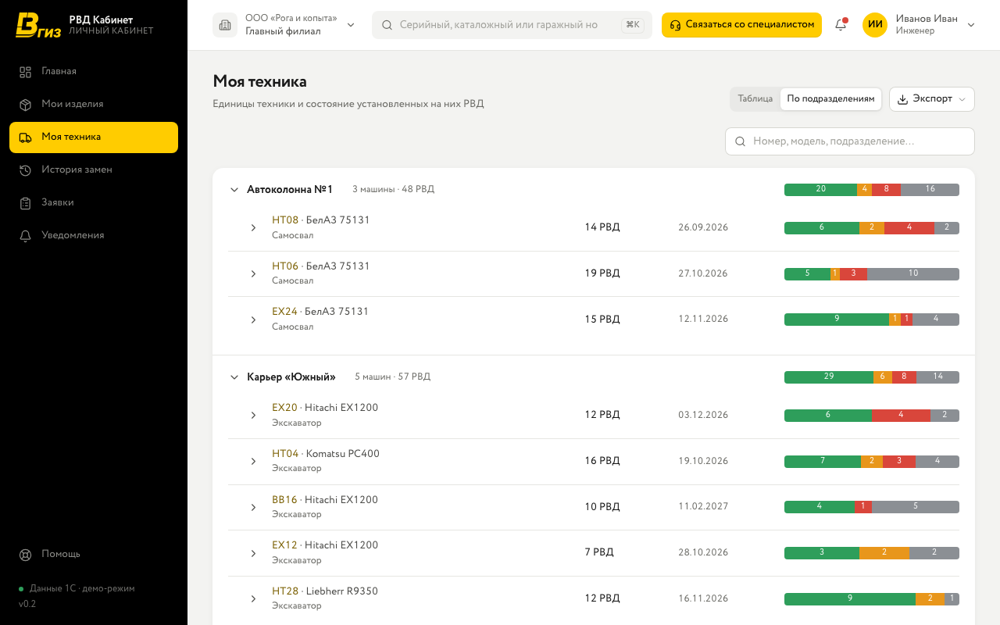
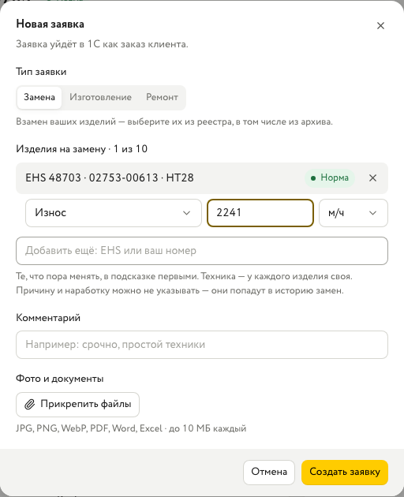
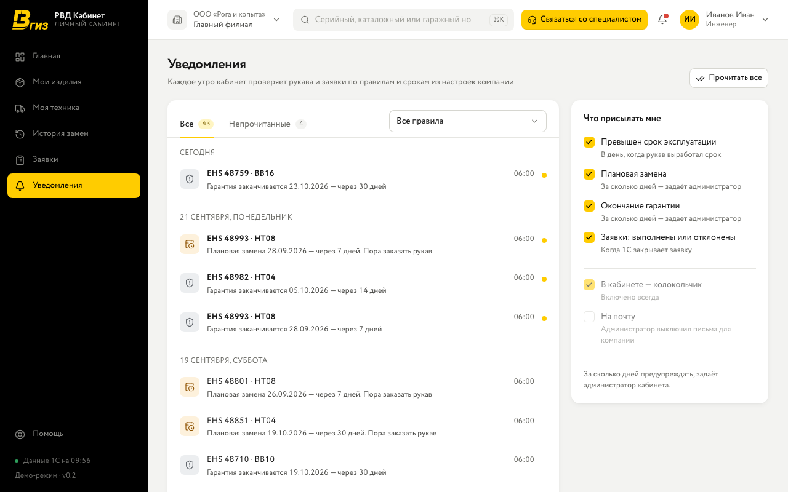

РВД Кабинет — личный кабинет клиента поставщика рукавов высокого давления. В нём видно каждое изделие, которое вам поставили: на какой технике и где оно стоит, сколько ему осталось до плановой замены, что пора заказать. Данные приходят из 1С поставщика — вносить их заново не нужно. В кабинете вы оформляете заявки, отмечаете, где стоит рукав, оставляете комментарии и прикладываете фото.

Адрес кабинета: **https://clientrvd.vgiz.ru**. Работает в браузере на компьютере, планшете и телефоне, устанавливать ничего не нужно.

> На снимках экрана в этой инструкции — демонстрационные данные.

## Вход и пароль

Учётную запись заводит администратор вашей компании (первого администратора — поставщик). Вход — по электронной почте и паролю.

- **Первый вход.** Администратор передаёт вам временный пароль или присылает письмо со ссылкой. С временным паролем кабинет сначала попросит придумать свой — не короче 10 символов.
- **Сменить пароль** — в меню пользователя справа вверху.
- **Забыли пароль** — обратитесь к администратору своей компании: он сбросит пароль и передаст новый временный или пришлёт ссылку.

## Как устроен экран

- **Меню слева** — разделы кабинета. Внизу меню написано, когда кабинет последний раз сверился с 1С («Данные 1С на 14:32»); сверка идёт каждые 10 минут. Если 1С не отвечает, под шапкой появится предупреждение, а кабинет продолжит показывать последние полученные данные.
- **Шапка**: компания и филиал, поиск, «Связаться со специалистом», уведомления (красная точка — есть непрочитанные), меню пользователя — тема (светлая, тёмная, как в системе), смена пароля, выход.
- **Филиал.** Если у компании несколько филиалов, в шапке их можно переключать: выберите филиал или «Все филиалы компании». Какие филиалы вам доступны, назначает администратор; механик работает в одном филиале.

## Статусы изделия

Срок считается от даты установки, а если её нет — от даты отгрузки. Плановая замена — начало срока плюс расчётный срок эксплуатации изделия. Статус показывает худшее из того, что верно на сегодня.

| Статус               | Что значит                                                                                                                         |
| -------------------- | ---------------------------------------------------------------------------------------------------------------------------------- |
| **Норма**            | Гарантия действует, до плановой замены ещё далеко                                                                                  |
| **Не на гарантии**   | Гарантия закончилась, срок эксплуатации ещё идёт; так же помечено изделие, у которого в 1С нет ни даты установки, ни даты отгрузки |
| **Внимание**         | До плановой замены меньше 30 дней — пора заказать рукав. Порог настраивает администратор компании                                  |
| **Требуется замена** | Расчётный срок эксплуатации вышел, рукав нужно менять                                                                              |

Статус выделен цветом везде одинаково: в таблицах, на карточках, на графиках и в полосах состояния у техники.

## Главная

Первым делом — что требует внимания. Показатели — отгружено изделий, в эксплуатации, на гарантии, срок истекает, требуют замены, замен за период — открывают реестр ровно с теми изделиями, которые они считают. Ниже — состояние изделий, замены по месяцам и ближайшие плановые замены. Период изменений — 30 дней, 90 дней или 12 месяцев. Кнопка «Экспорт» сохраняет сводку в Excel.

## Мои изделия

- **Поиск** — по номеру EHS, вашему внутреннему номеру, каталожному номеру, гаражному номеру техники и месту установки.
- **Фильтры** — статус, жизненный цикл, установлено или нет, техника, каталожный номер.
- **«Активные» и «Архив».** В архиве — списанные изделия.
- **«Колонки»** — какие столбцы показывать; **«Экспорт»** — таблица в Excel или CSV ровно такой, как на экране: с фильтрами, поиском и сортировкой, все страницы.
- **Заявка на замену сразу для нескольких изделий** — отметьте их галочками (до 10) и нажмите «Заявка на замену» в нижней панели.

## Карточка изделия

- **Срок службы** — сколько изделие уже в работе, сколько осталось до плановой замены, до какого числа гарантия; полоса показывает фазы срока и отметку «сегодня».
- **Технические данные и состав** — тип, диаметр, оплётка, каталожный номер, комплектующие.
- **История ЖЦ, замены, заявки, комментарии** — вкладки справа. История приходит из 1С; комментарии пишут ваши сотрудники (свои можно изменить и удалить).
- **Фото и документы** — нажмите «Добавить» или перетащите файлы на блок. JPG, PNG, WebP, PDF, Word, Excel, до 10 МБ каждый.
- **Место установки и внутренний номер** — ведёт ваша компания: кнопка «Изменить».
- **Дата установки и техника** — данные поставщика. Если они неверны, нажмите «Попросить исправить»: сообщение с изделием и верной датой уйдёт специалисту.
- **«Создать заявку на замену»** и **«Заказать такой же»** — заявки прямо с карточки.

## Моя техника

Два вида: **таблица** и **«По подразделениям»** (филиал → подразделение → машина → место установки → рукав, худшие первыми). Карточка машины показывает её рукава по местам установки и историю замен. Подразделение и заводской номер машины ведёт ваша компания — кнопка «Изменить» на карточке; перенести рукав на другую машину можно через специалиста.

## Заявки

Заявка уходит в 1С поставщика как заказ клиента. Три типа:

- **Замена** — только ваши изделия из реестра (в том числе из архива). У каждого изделия можно указать **причину замены** и **наработку** (моточасы или километры) — это не обязательно, но они попадут в историю замен.
- **Изготовление** — каталожные номера: выберите из подсказки, впишите вручную или вставьте списком. Номер, которого нет в справочнике, менеджер уточнит.
- **Ремонт** — ваши изделия и/или описание работы текстом.

В одной заявке — до 10 позиций; длинный список приложите файлом Excel (тогда строки можно не заполнять). К заявке можно приложить фото и документы. В компании с несколькими филиалами заявка оформляется на один филиал: изделия в ней — одного филиала; если изделий нет и в шапке выбраны все филиалы, форма попросит выбрать филиал.

**Что происходит дальше.** Пока заявка не дошла до 1С, она помечена «Отправляется в 1С» — кабинет отправит её сам. Затем у неё появляется номер 1С, а статус меняется: «Новая» → «В работе» → «Выполнена» или «Отклонена». О выполненной и отклонённой заявке придёт уведомление. Саму замену проводит поставщик — в «Истории замен» она появится, когда новое изделие будет отгружено.

## История замен

Какое изделие снято, какое установлено, на какой технике и когда. Журнал строится по данным 1С; причина и наработка — из вашей заявки на замену. Фильтры — период, техника, причина; «Экспорт» — в Excel или CSV.

## Уведомления

Кабинет сам напоминает:

- о конце гарантии и о плановой замене — заранее, за 30, 14 и 7 дней;
- о том, что срок эксплуатации вышел;
- о плановом осмотре рукавов — по каждой машине, раз в квартал;
- о выполненной или отклонённой заявке.

Колокольчик в шапке показывает последние; все — в разделе «Уведомления». Какие уведомления получать и нужны ли письма на почту, каждый выбирает сам в «Настройках уведомлений». Сроки предупреждений и частоту осмотров настраивает администратор компании; письма приходят, когда в кабинете подключена почта.

## Отчёты и сравнение техники

Для руководителя и администратора.

- **Отчёты** — реестр РВД, на гарантии, требуют замены, план замен на период, история замен, статистика по технике и по филиалам. Период — 30 дней, квартал, год или свои даты. Сохраняются в **Excel** и **PDF** (откроется страница печати — выберите «Сохранить как PDF»).
- **Сравнение техники** — 2–4 модели рядом: состояние рукавов, замены на единицу техники за год, показатели с отметкой лучшей модели.

## Поиск и сканер

Строка поиска в шапке (или **Ctrl K**, на Mac — **⌘K**) находит изделие по номеру EHS, внутреннему и каталожному номеру, гаражному номеру и месту установки, технику — по гаражному и заводскому номеру.

На телефоне в шапке есть **сканер**: наведите камеру на штрихкод или QR-код бирки — откроется изделие или машина. Если бирка стёрлась, введите номер вручную.

## Связаться со специалистом

Кнопка в шапке (на телефоне — в меню пользователя) и на карточке изделия. Выберите тему — «Исправить дату установки», «Вопрос по изделию», «Вопрос по заявке» или «Другое» — и напишите сообщение; изделие и верная дата уйдут вместе с ним. Так же исправляются любые данные поставщика: техника, место установки, даты.

## Администрирование

Для администратора компании.

- **Пользователи** — добавить сотрудника (ФИО, почта, роль, филиалы), изменить, сбросить пароль, отключить доступ (вход прекращается сразу). Свою роль и доступ меняет другой администратор.
- **Филиалы** — филиалы компании (клиенты в 1С поставщика) и сколько в каждом техники, рукавов в работе и пользователей.
- **Настройки** — когда изделие переходит во «Внимание», за сколько дней предупреждать, как часто напоминать об осмотре, разрешены ли письма.
- **Журнал** — кто, когда и что изменил в кабинете вашей компании.

## Роли

| Роль              | Что доступно                                                                  |
| ----------------- | ----------------------------------------------------------------------------- |
| **Механик**       | Свой филиал: изделия, техника, заявки, уведомления                            |
| **Инженер**       | Все филиалы компании (или назначенные): изделия, техника, заявки, уведомления |
| **Руководитель**  | То же, плюс отчёты и сравнение техники                                        |
| **Администратор** | То же, плюс пользователи, филиалы, настройки и журнал                         |

## Если что-то не так

- **Неверные данные об изделии** (дата установки, техника, место) — «Связаться со специалистом» или «Попросить исправить» на карточке: данные ведёт поставщик в 1С.
- **Не входит в кабинет** — проверьте почту и пароль; после нескольких неудачных попыток вход временно блокируется — подождите указанное время. Пароль сбрасывает администратор вашей компании.
- **Данные выглядят устаревшими** — посмотрите внизу меню, когда была последняя сверка с 1С.
